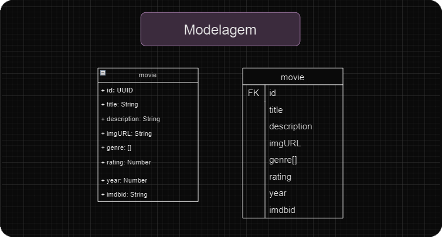

<h1>MyMovieListDatabase - Backend</h1>

Integração da API do projeto de avaliação de filmes, com objetivo de realizar os comandos CRUD com sucesso.
Tecnologias usadas: <b>Java Spring</b> e <b>PostgreSQL</b>

<h2>Modelagem </h2>

